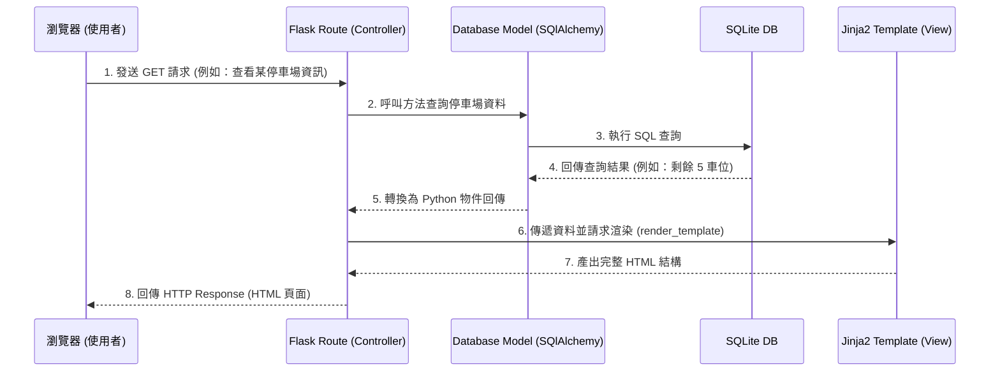

# 系統架構設計文件 (Architecture) - 校園停車way查詢系統

本文件基於產品需求文件 (PRD) ，規劃「校園停車way查詢系統」的技術架構與資料夾結構。這份架構會採用不分離前後端、以伺服器渲染為主的開發模式，適合快速迭代與初期驗證。

---

## 1. 技術架構說明

根據系統需求與技術限制，本專案將採用以下技術棧，並依循傳統的 MVC (Model-View-Controller) 架構模式：

### 選用技術與原因
- **後端框架：Python + Flask**
  - **原因**：Flask 輕量、靈活度高，適合快速開發從零開始的原型系統。針對校園停車系統需要的即時 API（如路況、停車場空位）實作成本低。
- **模板引擎：Jinja2**
  - **原因**：與 Flask 高度整合，能直接將後端取得的停車資訊或路徑資料動態渲染為 HTML 反應給前端，減少前端設定路由的成本。
- **資料庫：SQLite (推薦透過 SQLAlchemy ORM 操作)**
  - **原因**：設定極簡巧，作為 MVP 最合適。系統初期的停車位狀態、使用者資料與繳費紀錄可暫存在此，未來若流量擴大也能平滑遷移至 PostgreSQL 或 MySQL。

### Flask MVC 模式對應說明
- **M (Model - 模型)**：負責與 SQLite 互動，定義像是「使用者(User)」、「停車場(ParkingLot)」、「繳費紀錄(Payment)」等資料表結構。
- **V (View - 視圖)**：負責呈現畫面。在 Flask 中，即由 Jinja2 渲染的 `.html` 模板，以及輔助的靜態資源檔案（地圖 JS、CSS）。
- **C (Controller - 控制器)**：負責商業邏輯與路由分發。對應 Flask 中的 `routes`，接收使用者請求（如查詢剩餘車位），調用 Model 撈取資料後，最後回傳給 View 進行渲染。

---

## 2. 專案資料夾結構

本系統採用模組化 (Blueprints) 概念設計資料夾結構，以保持架構清晰。

```text
web_app_development/
├── app/                      ← 應用程式主要資料夾
│   ├── __init__.py           ← 初始化 Flask 實例與資料庫設定
│   ├── models/               ← 資料庫模型 (Model)
│   │   ├── __init__.py
│   │   ├── user.py           ← 使用者資料模型
│   │   ├── parking.py        ← 停車場與車位模型
│   │   └── payment.py        ← 停車繳費紀錄與月租模型
│   ├── routes/               ← 路由與業務邏輯 (Controller)
│   │   ├── __init__.py
│   │   ├── parking_route.py  ← 停車場剩餘車位與繳費路由
│   │   ├── traffic_route.py  ← 路況與車輛路線規劃路由
│   │   ├── transit_route.py  ← 大眾運輸轉乘路由
│   │   └── pedestrian_route.py ← 行人路線規劃與商圈導引路由
│   ├── templates/            ← Jinja2 HTML 模板 (View)
│   │   ├── base.html         ← 共用版型 (導覽列、頁尾)
│   │   ├── index.html        ← 首頁地圖與綜合查詢介面
│   │   └── parking/          ← 停車相關頁面模板
│   └── static/               ← 靜態資源檔案
│       ├── css/
│       │   └── style.css     ← 客製化樣式
│       ├── js/
│       │   └── map.js        ← 地圖互動與路線繪製腳本 (如整合 Leaflet/Google Maps)
│       └── images/           ← 系統圖示、商圈優惠圖片
├── instance/                 ← 存放本地機密與動態生成檔案 (不進版控)
│   └── database.db           ← SQLite 資料庫檔案
├── config.py                 ← 環境與設定檔 (資料庫連線字串等)
├── requirements.txt          ← Python 依賴清單 (flask, sqlalchemy 等)
├── .gitignore                ← Git 忽略清單
└── app.py                    ← 系統啟動入口
```

---

## 3. 元件關係圖

以下圖表展示使用者要求資料時，瀏覽器、Flask 路由、模板與資料庫之間的互動關係。



---

## 4. 關鍵設計決策

以下為專案開發初期的重要設計選擇，用以確保 MVP 階段的順暢度並將未來維護成本降至最低：

1. **伺服器端渲染 (SSR) 取代前後端分離：**
   - **原因**：在開發資源有限下，利用 Flask + Jinja2 產生畫面能免去建立龐大前端框架 (如 React, Vue) 與設計大量 RESTful API 的負擔。不僅加速 MVP 產出，對於有 SEO 需求（如商圈介紹、大型活動公告頁面）也更加友善。

2. **按功能劃分的路由系統 (Flask Blueprints)：**
   - **原因**：停車查詢、繳費、行人路線與大眾運輸等 5 大功能屬性皆不相同。採用 `routes/` 資料夾分拆不同業務的 Blueprint，能避免 `app.py` 變得極度肥大難以維護，也有助於團隊同時針對不同功能進行協作開發。

3. **採用 SQLite 作為輕量化資料方案：**
   - **原因**：初期無需處理繁瑣的資料庫連線池與網路設定。所有狀態保存在本機 `instance/database.db`，可隨時刪除重建，大幅加快開發與測試流程。後續使用 SQLAlchemy 封裝後，只要修改連線字串即可輕鬆升級到其他關聯式資料庫。

4. **單一地圖聚合介面設計 (Single Map Interface)：**
   - **原因**：不論是查看停車場、行車路況還是行人建議路線，使用者的主要互動與情境都在「校園地圖」上發生。因此前端架構決定將主地圖腳本 (`static/js/map.js`) 抽離並模組化，讓後端將不同類型的資料點（車場、商標、路線座標）傳入時，都能在同一張地圖圖層上作動態切換顯示，提供使用者最直覺的體驗。
