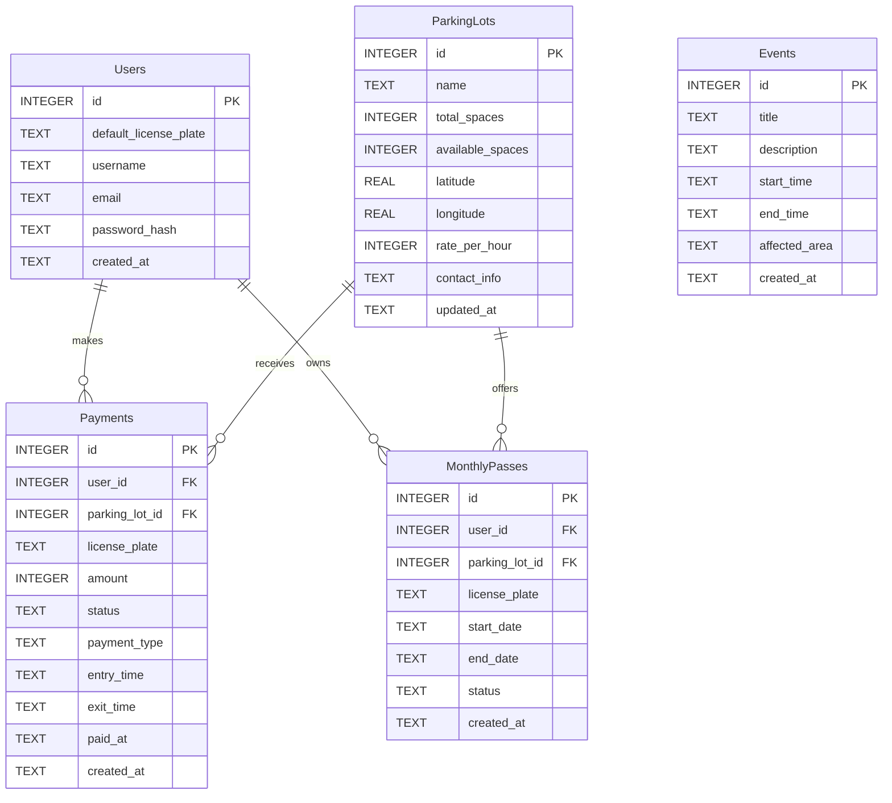

# DB_DESIGN (校園停車way查詢系統)

本文件描述系統的實體關係模組（ERD）以及資料表說明。

## 1. 實體關係圖 (ERD)

## 2. 資料表詳細說明

### Users (使用者)
| 欄位名稱 | 型別 | 屬性 | 說明 |
| :--- | :--- | :--- | :--- |
| `id` | INTEGER | PK, Auto Increment | 唯一識別碼 |
| `default_license_plate` | TEXT | NULL | 預設車牌，能於繳費或月租時自動帶入 |
| `username` | TEXT | NOT NULL | 使用者名稱 |
| `email` | TEXT | NOT NULL, UNIQUE | 註冊信箱 |
| `password_hash` | TEXT | NOT NULL | 密碼雜湊值 |
| `created_at` | TEXT | NOT NULL | 建立時間 (ISO) |

### ParkingLots (停車場)
| 欄位名稱 | 型別 | 屬性 | 說明 |
| :--- | :--- | :--- | :--- |
| `id` | INTEGER | PK, Auto Increment | 唯一識別碼 |
| `name` | TEXT | NOT NULL | 停車場名稱 |
| `total_spaces` | INTEGER | NOT NULL | 總車位數 |
| `available_spaces`| INTEGER | NOT NULL | 剩餘可用車位 |
| `latitude` | REAL | NOT NULL | 緯度座標 |
| `longitude` | REAL | NOT NULL | 經度座標 |
| `rate_per_hour` | INTEGER | NOT NULL | 停車費率 (每小時) |
| `contact_info` | TEXT | NULL | 聯絡或介紹資訊 |
| `updated_at` | TEXT | NOT NULL | 狀態最近更新時間 |

### Payments (繳費紀錄)
| 欄位名稱 | 型別 | 屬性 | 說明 |
| :--- | :--- | :--- | :--- |
| `id` | INTEGER | PK, Auto Increment | 唯一識別碼 |
| `user_id` | INTEGER | FK | 關聯使用者 (可空，訪客繳費) |
| `parking_lot_id` | INTEGER | FK | 關聯停車場 |
| `license_plate` | TEXT | NOT NULL | 入場車牌 |
| `amount` | INTEGER | NOT NULL | 總金額 |
| `status` | TEXT | NOT NULL | pending/paid 等繳費狀態 |
| `payment_type` | TEXT | NOT NULL | hourly/monthly_fee 等付費類型 |
| `entry_time` | TEXT | NOT NULL | 進場時間 |
| `exit_time` | TEXT | NULL | 離場時間 |
| `paid_at` | TEXT | NULL | 完成付款時間 |
| `created_at` | TEXT | NOT NULL | 訂單建立時間 |

### MonthlyPasses (月租通行證)
| 欄位名稱 | 型別 | 屬性 | 說明 |
| :--- | :--- | :--- | :--- |
| `id` | INTEGER | PK, Auto Increment | 唯一識別碼 |
| `user_id` | INTEGER | FK | 關聯申請的使用者 |
| `parking_lot_id` | INTEGER | FK | 關聯停車場 |
| `license_plate` | TEXT | NOT NULL | 使用月租的車牌 |
| `start_date` | TEXT | NOT NULL | 月租生效日 (ISO Date) |
| `end_date` | TEXT | NOT NULL | 月租到期日 (ISO Date) |
| `status` | TEXT | NOT NULL | active/expired/pending |
| `created_at` | TEXT | NOT NULL | 申請建立時間 |

### Events (交管與活動)
| 欄位名稱 | 型別 | 屬性 | 說明 |
| :--- | :--- | :--- | :--- |
| `id` | INTEGER | PK, Auto Increment | 唯一識別碼 |
| `title` | TEXT | NOT NULL | 活動標題 |
| `description` | TEXT | NULL | 活動或改道詳細說明 |
| `start_time` | TEXT | NOT NULL | 開始時間 (ISO) |
| `end_time` | TEXT | NOT NULL | 結束時間 (ISO) |
| `affected_area` | TEXT | NULL | 影響區域標示 (例如商街座標/多邊形JSON串) |
| `created_at` | TEXT | NOT NULL | 建立時間 |
