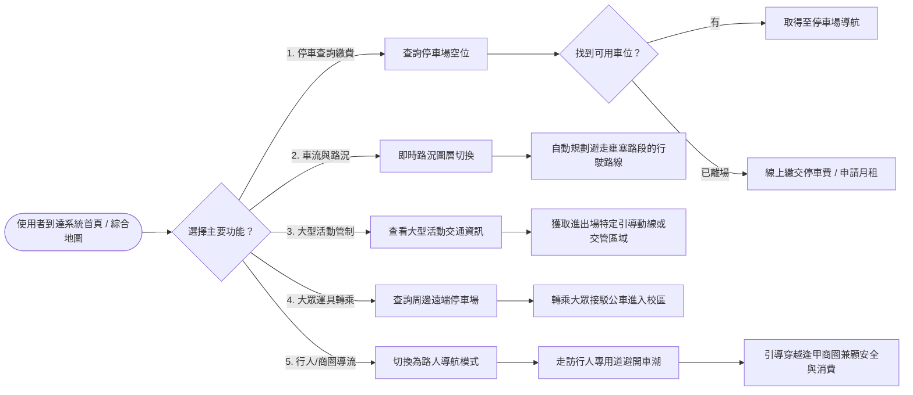
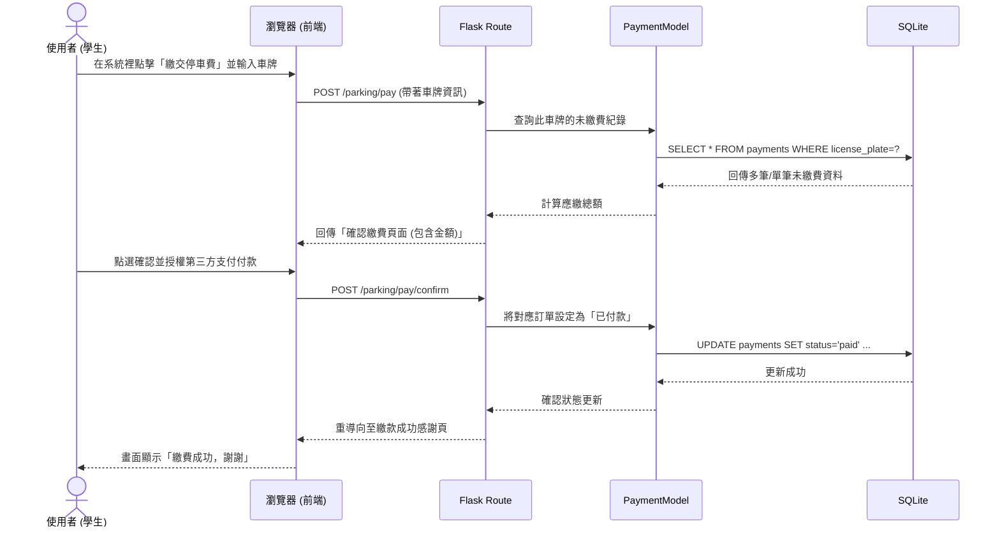

# 流程圖與路由對照文件 (FLOWCHART) - 校園停車way查詢系統

本文件基於 PRD 的五大核心功能與已經定義的架構，視覺化展現系統的使用者操作體驗 (User Flow) 以及系統底層互動邏輯 (System Flow)，並定出初始的功能 URL 路由表。

---

## 1. 使用者流程圖 (User Flow)

描述使用者進入系統首頁後，根據不同的行車或步行情境所選擇的互動路徑。

---

## 2. 系統序列圖 (Sequence Diagram)

這裡以「使用者線上繳交停車費」的流程為例，展示前端瀏覽器、後端 Flask 控制器與 SQLite 資料庫間的互動細節。

---

## 3. 功能清單與路由對照表

開發初期依據功能切割，預計的 HTTP 路由、方法及作用。

| 功能名稱 | URL 路徑 | HTTP 方法 | 說明 |
| :--- | :--- | :--- | :--- |
| **系統首頁 (綜合地圖)** | `/` | GET | 預設視角，呈現地圖介面、基礎路況、鄰近停車場分布 |
| **查看停車場狀態** | `/api/parking/status` | GET | 抓取各個停車場最新資訊（剩餘車位數、費率等） |
| **線上繳交停車費** | `/parking/pay` | GET, POST | GET 顯示車牌輸入介面；POST 處理查詢與確認繳納表單 |
| **智慧行車導航** | `/api/route/drive` | GET | 給定起訖點，回傳避開主要幹道壅塞路段的導航座標 |
| **大眾運輸轉乘建議** | `/api/transit/options` | GET | 查詢距校區較遠的「替代停車點」與「接駁車」資訊 |
| **智慧行人路線推薦** | `/api/route/walk` | GET | 給定起訖點，提供走私房小路/商店街的安全行人專用道路線 |
| **大型活動交管查詢** | `/api/events/traffic` | GET | 取得近期的交管快訊、路障封鎖區域與建議引導路線 |
